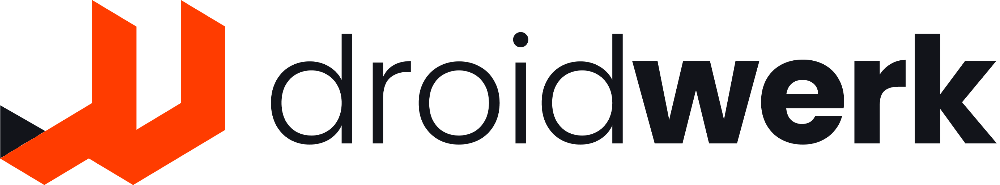

  <picture>
    <source media="(prefers-color-scheme: dark)" srcset="desktop/src/assets/logo-droidnote.png">
    
  </picture>

  <strong>Assistente local de gravações.</strong> 
  Transcreva e gere notas neste computador — sem conta obrigatória e sem bot no Meet, Teams ou Zoom.

  
  &nbsp;
  

  Windows 10/11 · x64 · sem administrador 
  Português · English · Español · Italiano · Deutsch · Français · Русский

---

## O que faz

O DroidNote captura o microfone e, se você quiser, o áudio de outros aplicativos. A transcrição aparece ao vivo. Depois você identifica falantes e gera uma nota para ditado, aula ou reunião.

| Captura | Transcrição | Notas |
| --- | --- | --- |
| Microfone e áudio do sistema, neste PC | Whisper local ou API OpenAI | Resumo no dispositivo ou via OpenAI |
| Sem bot convidado na chamada | Idioma da captura independente do idioma da interface | Chat sobre as sessões, com fontes agrupadas |

A interface e a transcrição são duas escolhas distintas. O app pode ficar em português e a captura em alemão, por exemplo.

---

## Onde o áudio é processado

Você escolhe no primeiro uso e pode mudar em Preferências.

**Modelos locais** — áudio, transcrição e notas permanecem neste computador. O app baixa o motor de transcrição (e, se faltar, o motor de notas) e mostra o tamanho antes de instalar.

**API OpenAI** — mais preciso, com chave própria. O áudio da transcrição e trechos da nota saem deste PC e vão para a OpenAI. Vale a [política de privacidade da OpenAI](https://openai.com/policies/privacy-policy).

O arquivo WAV é opcional e pode ser desligado. A chave da API, se você usar uma, fica só nesta máquina.

Grave outras pessoas somente com o consentimento adequado. O app não avisa os demais participantes da chamada.

---

## Instalar

1. Baixe o [DroidNote-Setup.exe](https://github.com/droidwerk/droidNote/releases/latest/download/DroidNote-Setup.exe).
2. Execute o instalador **sem administrador**. Ele instala só para o usuário atual.
3. No primeiro uso, escolha o idioma da interface, o caminho de processamento e aceite os termos.

O Windows SmartScreen pode avisar na primeira execução enquanto o instalador não leva assinatura Authenticode. Use **Mais informações** e **Executar assim mesmo** se você baixou deste repositório.

Dados do usuário ficam em `%APPDATA%\DroidNote`. O programa fica em `%LOCALAPPDATA%\DroidNote`.

---

## Atualizar

Quem já está na 2.1.0 ou posterior vê um aviso quando sai uma versão nova. **Baixar** abre o instalador; **Agora não** esconde o aviso até a versão seguinte.

A instalação é por cima da atual. Notas, gravações e modelos não são apagados. A atualização não é automática.

---

## Documentação técnica

- [Arquitetura](docs/architecture.md) — processos, camadas, dados, captura, notas, atualização
- [Desenvolvimento](docs/development.md) — `dev.ps1`, testes, build do Setup

---

## Requisitos

- Windows 10 ou 11, 64 bits
- Microfone (e, para áudio do sistema, um dispositivo de loopback disponível)
- Espaço em disco para os modelos locais, se você escolher esse caminho

---

  <a href="https://www.droidwerk.com.br/">
    <picture>
      <source media="(prefers-color-scheme: dark)" srcset="desktop/src/assets/logo-droidwerk.png">
      
    </picture>
  </a> 
  Produto <a href="https://www.droidwerk.com.br/">DroidWerk</a>

