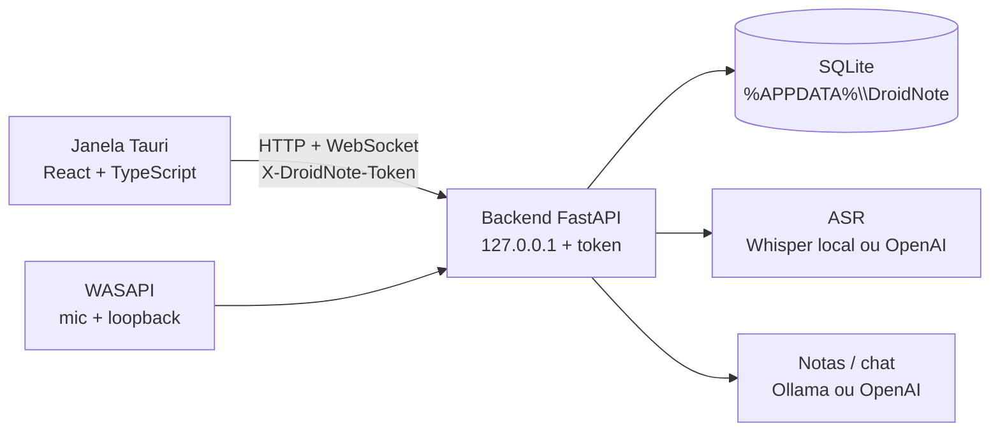

# Arquitetura

DroidNote é um app desktop Windows: uma janela Tauri (React) fala com um backend FastAPI que corre **neste PC**, em `127.0.0.1`. Não há servidor na nuvem DroidWerk. Conta e bot em Meet/Teams/Zoom não existem.

O processamento de áudio e notas é um **porto** (`AsrPort`, `LlmPort`). A implementação muda conforme o utilizador escolhe modelos locais ou API OpenAI. O resto da aplicação (sessões, captura, UI) não sabe qual motor está por baixo.

## Vista geral



Na instalação, o programa vive em `%LOCALAPPDATA%\DroidNote`. Dados do utilizador (base, modelos, gravações, `runtime.json`) ficam em `%APPDATA%\DroidNote`. Em desenvolvimento o perfil é `%APPDATA%\DroidNote-dev`, para não misturar com o app instalado.

## Processos

| Processo | Papel |
| --- | --- |
| `droidnote.exe` | Shell Tauri: janela, tray, instância única, arranque do sidecar |
| `droidnote-backend.exe` | FastAPI empacotado com PyInstaller (`resources/droidnote-backend/`) |
| Ollama (opcional) | Motor de notas local, processo à parte, em `127.0.0.1:11434` |

O shell espera uma linha `DROIDNOTE_READY {host, port, token}` no stdout do sidecar (timeout 45 s). A UI chama `invoke("get_backend")` e passa URL + token ao cliente HTTP. Sem essa handshake a janela não fala com a API.

O instalador NSIS mata `droidnote.exe` **e** `droidnote-backend.exe` antes de gravar ficheiros. O sidecar PyInstaller bloqueia `.pyd` se ficar órfão.

Atualização: a UI consulta `https://api.github.com/repos/droidwerk/droidNote/releases/latest` e mostra um diálogo. Não há `tauri-plugin-updater`. Motivo: o Setup ainda não leva Authenticode EV.

## Camadas do backend

Hexagonal, dependências para dentro.

```
backend/app/
  domain/           modelos e Protocol (AudioCapturePort, AsrPort, LlmPort, SessionRepository)
  application/      casos de uso: captura, sessões, resumo, chat, setup, falantes
  infrastructure/   WASAPI, Whisper, OpenAI, Ollama, SQLite
  api/v1/           HTTP / WebSocket
  core/             config, token, DPAPI, i18n, hardware
```

`create_app` monta o `AppContainer` no lifespan: store, ASR, LLM, `CaptureService`, `ChatService`, etc. OpenAPI/Swagger estão **desligados** (`docs_url=None`): a API não é um produto público.

### Rotas

| Superfície | Função |
| --- | --- |
| `GET /health` | Liveness sem token (usado pelo `dev.ps1`) |
| `/capture`, `/sessions`, `/setup`, `/people`, `/tags`, `/chat` | REST autenticado |
| `WS /ws/transcript` | Segmentos e estado de captura em tempo real |

Header: `X-DroidNote-Token`. No WebSocket o mesmo token vai em query ou header. O token é gerado no arranque (`secrets.token_urlsafe`) e não sai da máquina.

CORS só aceita origens da UI local (`localhost:1420`, `tauri.localhost`, …).

## Dados

SQLite em `%APPDATA%\DroidNote\droidnote.db` (`aiosqlite`).

Tabelas: `sessions`, `segments`, `people`, `session_participants`, `summaries`, `settings`, `tags`, `session_tags`, `chats`, `chat_messages`.

Gravações WAV (se ligadas): `%APPDATA%\DroidNote\recordings\<session_id>.wav`. Modelos Whisper: `...\models\`.

A chave `asr_api_key` na tabela `settings` é protegida com DPAPI do Windows (`dpapi:v1:`). Texto antigo é lido e migrado.

## Captura e transcrição

1. WASAPI captura mic e, se pedido, loopback do sistema, a 16 kHz.
2. `CaptureService` parte o áudio em janelas (~20 s, 1 s de overlap) e manda ao `AsrRouter`.
3. `neste_pc`: Faster-Whisper no processo do sidecar. `openai`: Whisper da API.
4. Segmentos vão para SQLite e para o `EventBus`; o WebSocket empurra à UI.

Idioma da **captura** (`language`, inclui `auto`) é independente do idioma da **interface** (`ui_language`). O instalador pode semear a UI via `%APPDATA%\DroidNote\install-lang.txt`.

## Notas e chat

`LlmRouter` escolhe Ollama (modelos locais) ou `OpenAIChatEngine`. `SummarizeService` gera a nota da sessão. `ChatService` responde sobre transcrições já gravadas. Os dois caminhos usam o mesmo porto `LlmPort`.

Na primeira execução, se não houver modelo gravado, o backend escolhe Whisper e modelo de notas consoante a RAM (`hardware.py`), em vez de assumir um modelo grande.

## Frontend

```
desktop/src/
  app/App.tsx          boot, wizard, shell, estado de captura
  pages/              Live, sessão, chat, preferências
  features/           captura, transcrição, notas, pastas, wizard
  shared/api          cliente HTTP/WS
  shared/i18n         catálogos pt/en/es/it/de/fr/ru
```

A UI não persiste o domínio. Persistência e motores estão no sidecar.

## Trade-offs

- **Sidecar Python em vez de ASR em Rust.** Whisper/Ollama/FastAPI já existiam no backend. Custo: dois processos e o NSIS precisa matar os dois.
- **SQLite local, um utilizador.** Sem sync, sem multi-tenant. Simples e alinhado com “dados neste PC”.
- **Aviso de versão, não auto-update.** Sem certificado EV o updater oficial do Tauri não é honesto com o Windows.
- **API só em loopback.** Qualquer página no PC que descubra o token poderia chamar a API. O token é por sessão de processo e a UI não o expõe. Não é um servidor na LAN.
- **OpenAPI fechado.** Menos superfície; a documentação da API é este ficheiro e o código em `api/v1`.
